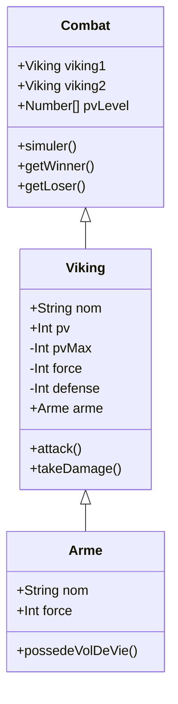

```mermaid
classDiagram
    Viking<|--Arme
    Combat<|--Viking
    class Viking{
        +String nom
        +Int pv
        -Int pvMax
        -Int force
        -Int defense
        +Arme arme
        +attack()
        +takeDamage()
    }
    class Arme {
        +String nom
        +Int force
        +possedeVolDeVie()
    }
    class Combat{
        +Viking viking1
        +Viking viking2
        +Number[] pvLevel
        +simuler()
        +getWinner()
        +getLoser()
    }
```
