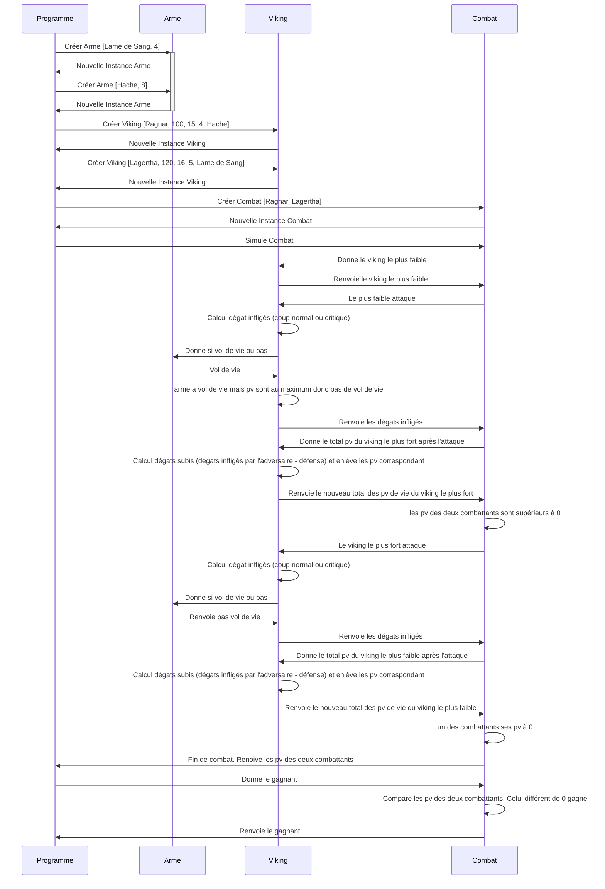

```mermaid
sequenceDiagram
Programme->>+Arme: Créer Arme [Lame de Sang, 4]
Arme->>Programme: Nouvelle Instance Arme
Programme->>Arme: Créer Arme [Hache, 8]
Arme->>-Programme: Nouvelle Instance Arme
Programme->>Viking: Créer Viking [Ragnar, 100, 15, 4, Hache]
Viking->>Programme: Nouvelle Instance Viking
Programme->>Viking: Créer Viking [Lagertha, 120, 16, 5, Lame de Sang]
Viking->>Programme: Nouvelle Instance Viking
Programme->>Combat: Créer Combat [Ragnar, Lagertha]
Combat->>Programme: Nouvelle Instance Combat
Programme->>Combat: Simule Combat
Combat->>Viking: Donne le viking le plus faible
Viking->>Combat: Renvoie le viking le plus faible
Combat->>Viking: Le plus faible attaque
Viking->>Viking: Calcul dégat infligés (coup normal ou critique)
Viking->>Arme: Donne si vol de vie ou pas
Arme->>Viking: Vol de vie
Viking->>Viking: arme a vol de vie mais pv sont au maximum donc pas de vol de vie
Viking->>Combat: Renvoie les dégats infligés
Combat->>Viking: Donne le total pv du viking le plus fort après l'attaque
Viking->>Viking: Calcul dégats subis (dégats infligés par l'adversaire - défense) et enlève les pv correspondant
Viking->>Combat: Renvoie le nouveau total des pv de vie du viking le plus fort
Combat->>Combat: les pv des deux combattants sont supérieurs à 0
Combat->>Viking: Le viking le plus fort attaque
Viking->>Viking: Calcul dégat infligés (coup normal ou critique)
Viking->>Arme: Donne si vol de vie ou pas
Arme->>Viking: Renvoie pas vol de vie
Viking->>Combat: Renvoie les dégats infligés
Combat->>Viking: Donne le total pv du viking le plus faible après l'attaque
Viking->>Viking: Calcul dégats subis (dégats infligés par l'adversaire - défense) et enlève les pv correspondant
Viking->>Combat: Renvoie le nouveau total des pv de vie du viking le plus faible
Combat->>Combat: un des combattants ses pv à 0
Combat->>Programme: Fin de combat. Renoive les pv des deux combattants
Programme->>Combat: Donne le gagnant
Combat->>Combat: Compare les pv des deux combattants. Celui différent de 0 gagne
Combat->>Programme: Renvoie le gagnant.
```
